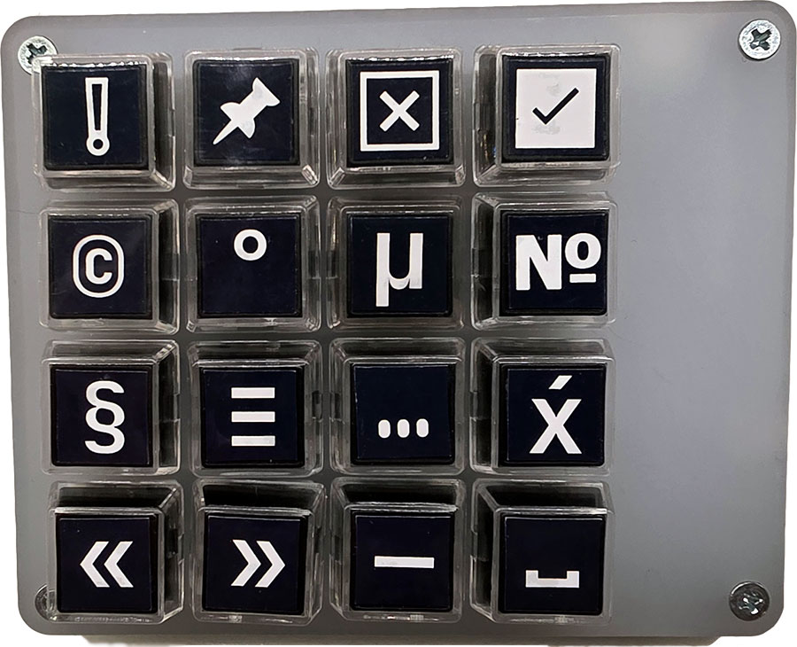
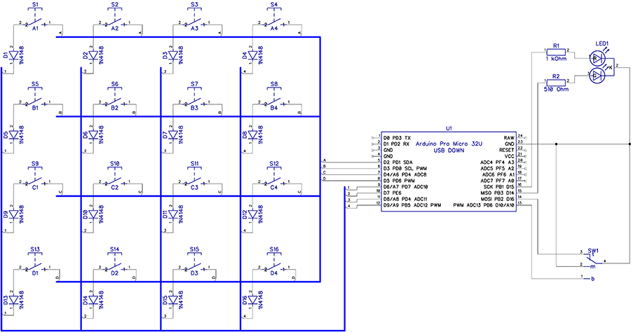
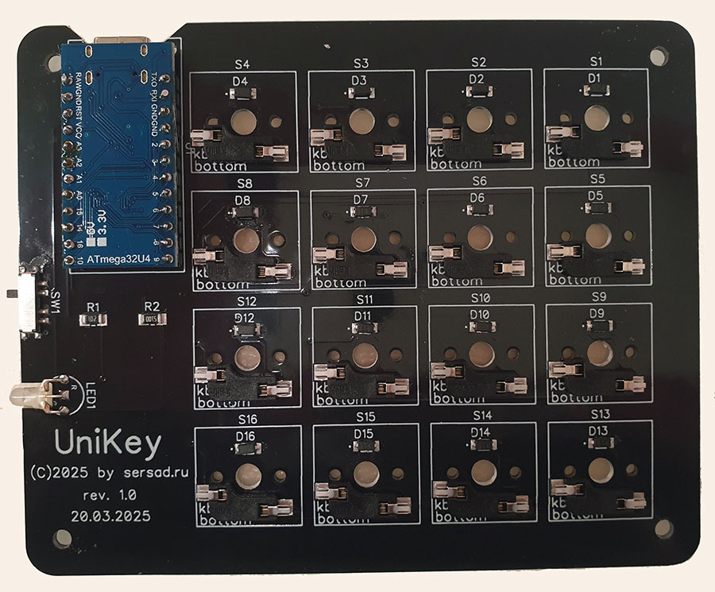

# UniKey
Additional keyboard for unicode characters.
</p>


## Table of contents
* [Overview](#overview)
* [Hardware](#hardware)
* [Software](#software)
* [History](#history)


## Overview

This is a little keypad which helps to enter unicode symbols. It emulates `<Alt>+0+<Keypad>` sequence for Windows and `<Ctrl>+<Shift>+<u>` for Gnome. Of course it can send HTML `&#`-codes. 

3-position switch helps to choose the mode. 
* First position (`green` LED) used (by default) for `Windows` mode.
* Second position (`red` LED) used for `HTML` mode.
* Middle position (`yellow` LED) used for `Gnome` mode.

Default behavior of switch and symbol codes for keys can be configured through [Serial port](#Serial-configuration).

The device implements HID protocol and needs no drivers for your OS.


## Hardware
The device is based on:
*  `Arduino Pro Micro ATMega32U4` 
*  16 keys width diodes
*  3-mode side switch
*  Red-green control LED

<p align="center"></p>

</p>


## Software
This device emulates a HID keyboard. When you press a key it emulates the key sequence (depended on mode-switch) to send the unicode symbol to your OS.

>*Note. When using this device with `Gnome`, make sure that the sequence `<Ctrl>+<Shift>+<u>` is not used by the active application for its own purposes.*

### Dependencies
1. [Arduino <Keyboard.h> library](https://docs.arduino.cc/libraries/keyboard/)
2. [ssMultiPrint libraty](https://github.com/sersad-ru/ssMultiPrint)
3. [ssExecutor library](https://github.com/sersad-ru/ssExecutor)


### Serial configuration
In addition to emulating HID devices, UniKey also sends and receives messages via a COM port. You can connect to it using any COM terminal program. Port specification: `9600 8N1`. This connection can be used to configure device settings.

>*Simple Ubuntu example:*
```
$minicom -D /dev/ttyACM0
<Ctrl>-A E  
<Ctrl>-A U  
...
<Ctrl>-A X
```

Available configuration commands are:

|Command|Params|Description|
|:---:|:---:|:---|
|`h`|none|Get the list of available commands|
|`?`|none|Get the version information and current configuration|
|`l`|none|Dispaly the keyboard layout|
|`&`|`F`|Reset the configuration to defaults. Example: `&F`|
|`t`|none|Turn on or off the test mode. In the test mode key numbers and unicode codes will be send only to COM-port. No key-sequence will be sent to the PC.|
|`g`|none|Swap `Windows` and `Gnome` mode between the `First` (`green` LED) and `Middle` (`yellow` LED) position of the mode-switch. The `Second` position (`red` LED) is always used for `HTML` mode.|
|`k`|`X=C`|Assign the code `C` to the `X` key. Example: `k0=169`. The code **169** (unicode symbol `©`) will be assigned to the key **0**.|

### Keyboard layout
```
┌─────┬─────┬─────┬─────┬─────┐
│ k00 │ k01 │ k02 │ k03 │     │
├─────┼─────┼─────┼─────┤     │
│ k04 │ k05 │ k06 │ k07 │     │
├─────┼─────┼─────┼─────┤     │
│ k08 │ k09 │ k10 │ k11 │     │
├─────┼─────┼─────┼─────┤     │
│ k12 │ k13 │ k14 │ k15 │     │
└─────┴─────┴─────┴─────┴─────┘ 

```

## History
* 1.0 - First stable release. 2025-05-26.